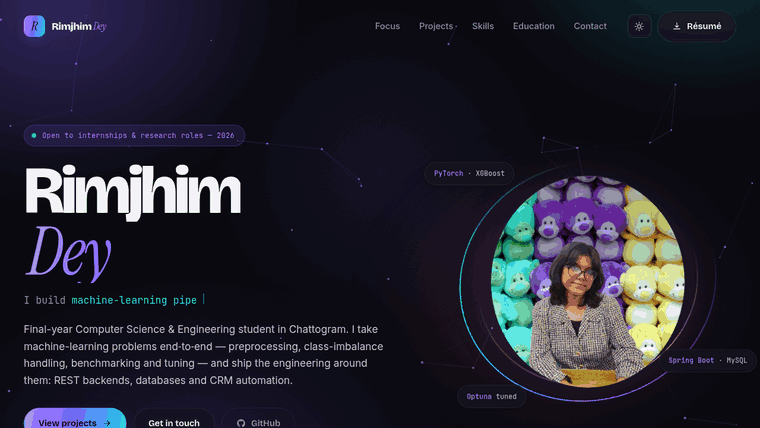

<div align="center">

<a href="https://rimjhimd.github.io/PORTFOLIO/">
  
</a>

<br>

<a href="https://rimjhimd.github.io/PORTFOLIO/"></a>


<br>


<br><br>

<a href="https://rimjhimd.github.io/PORTFOLIO/">
  
</a>

<sub>Recorded from the live site. Dark theme, scroll-spy navigation, reveal-on-scroll, particle field.</sub>

</div>

<br>

## About

Personal portfolio of **Rimjhim Dey**, a final-year Computer Science & Engineering student at Premier University,
Chattogram. The work spans three lanes: machine-learning pipelines and applied research, REST backends and data
layers, and workflow automation with n8n and CRM platforms. The site is hand-written HTML, CSS and JavaScript, with
no framework and no build step, and it is served straight from this repository through GitHub Pages.

## What I work on

<table>
  <tr>
    <td width="33%" valign="top">
      <h3>Machine learning</h3>
      Feature engineering, resampling for class imbalance, stratified k-fold and honest benchmarking across gradient
      boosting and neural networks, with Optuna handling hyperparameter search.
      <br><br>
      <code>scikit-learn</code> <code>PyTorch</code> <code>TensorFlow</code> <code>XGBoost</code> <code>Optuna</code>
    </td>
    <td width="33%" valign="top">
      <h3>Backends &amp; data</h3>
      Layered REST APIs with server-side search, sorting, pagination and authentication over relational schemas,
      wired to React front-ends and shipped through CI.
      <br><br>
      <code>Spring Boot</code> <code>FastAPI</code> <code>JPA</code> <code>MySQL</code> <code>GitHub Actions</code>
    </td>
    <td width="33%" valign="top">
      <h3>Automation</h3>
      n8n workflow automations, CRM and billing workflows, scheduling pipelines and webhook integrations that
      replace manual repetition with scheduled jobs and API calls.
      <br><br>
      <code>n8n</code> <code>GoHighLevel</code> <code>Webhooks</code> <code>REST integrations</code> <code>Python</code>
    </td>
  </tr>
</table>

## n8n workflow automations

<div align="center">
  
</div>

<br>

I design and build n8n workflows that take repetitive operational work off people's plates. A typical flow starts
from a trigger (an incoming webhook, a form submission or a cron schedule), cleans and reshapes the payload in a Code
node, branches on business rules with If and Switch nodes, and then fans out to the systems that need the result:
enriching a record over an HTTP Request, upserting the contact into a CRM such as GoHighLevel, alerting the team, and
starting a follow-up sequence. The diagram above is an example of that shape rather than a specific client build.

The parts I care about most are the ones that keep an automation trustworthy after launch:

- **Triggers** — webhooks, schedules and app events, with payload validation before anything is written.
- **Integrations** — REST APIs through HTTP Request nodes, credentials kept in n8n rather than in node bodies.
- **Data shaping** — JavaScript Code nodes for normalising names, phones and dates so downstream systems agree.
- **Branching** — If / Switch routing, so qualified and unqualified records take different paths.
- **CRM sync** — create-or-update contacts, tags and pipeline stages without producing duplicates.
- **Reliability** — error workflows, retries on flaky APIs and execution logs that make failures visible.

## Featured projects

| Project | What it is | Stack |
| --- | --- | --- |
| [**Cerebral Stroke Prediction**](https://github.com/RimjhimD/Cerebral-Stroke-Prediction-using-Machine-Learning) | End-to-end pipeline on clinical data with class-imbalance resampling and stratified benchmarking | Python · scikit-learn · PyTorch · XGBoost · Optuna |
| **Skin Cancer Type Detection** | DenseNet, ResNet and a Vision Transformer benchmarked on HAM10000 dermatoscopy images | Python · CNNs · ViT · Colab |
| [**CRUDCare — Blood Bank Management**](https://github.com/RimjhimD/CRUDCare-Blood-Bank-Management-System-) | Donor, stock and request management with authentication and role-based access | PHP · MySQL |
| [**PayCraft — Digital Payment Interface**](https://github.com/RimjhimD/PayCraft) | Responsive payment web app with a validated form and transaction table | HTML · CSS · JavaScript |
| [**ESP32 Web Server + DHT11**](https://github.com/RimjhimD/ESP-32-Web-Server-with-DHT11-Sensor) | Microcontroller serving live temperature and humidity over its own web server | C++ · ESP32 · DHT11 |
| [**Bank Management System**](https://github.com/RimjhimD/Bank-Management-System) | Console banking app with accounts, deposits, withdrawals and history | Java · OOP · File I/O |

## Toolkit

<div align="center">
  
  <br><br>
  
  <br><br>
  
  <br><br>
  
  
  
  
</div>

## Site features

- **Motion layer** — intro curtain, cursor-reactive particle constellation, drifting gradient mesh, film grain,
  magnetic buttons, 3D card tilt, split-word heading reveals and a self-drawing education timeline.
- **Themes** — dark and light, remembered in `localStorage` and defaulting to the OS preference.
- **Navigation** — scroll progress bar, side progress rail, scroll-spy nav with a sliding pill, full-screen mobile menu.
- **Projects** — filterable grid (ML & Research / Web / Desktop & IoT), each card linking to its repository.
- **Accessible** — skip link, semantic landmarks, visible focus rings, `aria` labels, and a full
  `prefers-reduced-motion` fallback that switches every animation off.
- **Responsive and printable** — works down to 360px, and a print stylesheet turns the page into a clean document.

## Structure

```
index.html              markup, one file
css/styles.css          design tokens, layout, components, animation, responsive rules
js/script.js            theme, nav, scroll-spy, reveal, typed roles, filters, particle field, form
assets/Rii.png          portrait
assets/*.pdf            résumé
.github/assets/         README banner, n8n diagram, footer and preview GIF
```

## Running locally

Nothing to install. Open `index.html` directly, or serve the folder:

```bash
git clone https://github.com/RimjhimD/PORTFOLIO.git
cd PORTFOLIO
python3 -m http.server 8000
# http://localhost:8000
```

## Customising

All colours, spacing, radii, shadows and fonts are CSS custom properties at the top of `css/styles.css`: `:root`
for the dark theme and `html[data-theme="light"]` for the light one. Changing the accent everywhere is a two-line edit:

```css
--accent:   #7C5CFF;
--accent-2: #22D3EE;
```

Projects are plain `<article class="card project" data-cat="…">` blocks in `index.html`. Add one with a `data-cat`
that matches a filter button and the filter picks it up with no JavaScript change.

## Contact

<div align="center">

<a href="mailto:rimjhimdey91@gmail.com"></a>
<a href="https://www.linkedin.com/in/rimjhim-dey-69ba6337b/"></a>
<a href="https://github.com/RimjhimD"></a>

</div>

## Licence

MIT, see [LICENSE](LICENSE). Content and images are mine; the code is free to learn from.


